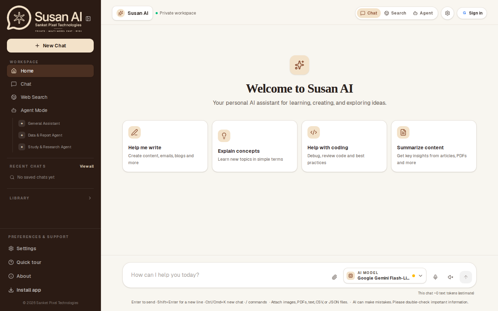
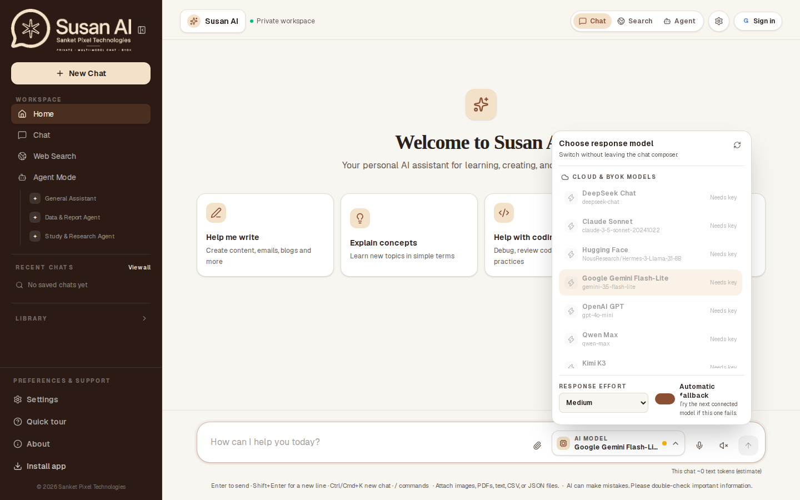
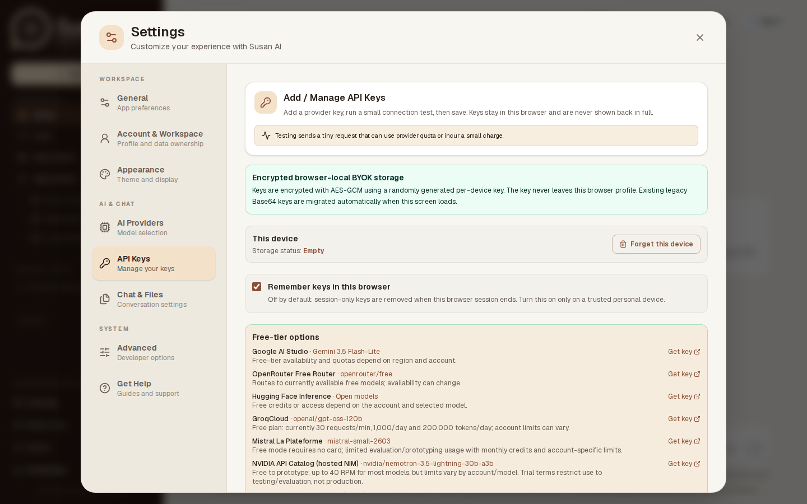
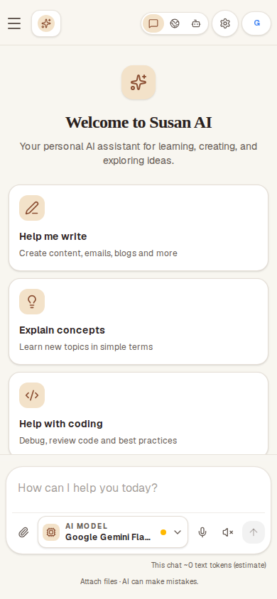

<div align="center">
  
  <h1>Susan AI</h1>
  <p><strong>Private multi-model AI chat with Bring Your Own Key support</strong></p>
  <p>A private, flexible, and provider-agnostic AI workspace by Sanket Pixel Technologies.</p>
</div>

Susan AI is a modern personal AI assistant that brings multiple leading language-model providers into one focused chat workspace. It is designed for users who want the freedom to choose their own models and API keys while keeping conversations under their control. With Bring Your Own Key (BYOK) support, local conversation storage, streaming responses, and a responsive interface, Susan AI provides a practical foundation for everyday research, writing, coding, brainstorming, and productivity workflows.

## Product overview

Susan AI provides one streamlined chat interface for DeepSeek, Claude, Hugging Face, Gemini, OpenAI, Qwen, Kimi, Manus, Sarvam, and OpenRouter integrations. Users can select the provider and model that best fit each task, bring their own credentials, and switch between supported services without leaving the workspace. Conversations are persisted locally in the browser, and users can export or import their chat history as JSON. The application is suitable for personal use, experimentation with multiple AI providers, and self-managed deployments where privacy and configuration flexibility matter.

## Demo & screenshot gallery

The gallery below is captured from the current production deployment at [susan-ai.vercel.app](https://susan-ai.vercel.app/). It replaces the previous reference/mockup images with fresh desktop and mobile captures of the live privacy-first workspace, including the inline model picker and grouped Settings control center.

**Live demo:** [Open Susan AI on Vercel](https://susan-ai.vercel.app/)

### Production desktop workspace

<div align="center">
  
</div>

### Inline model selector

<div align="center">
  
</div>

### Settings control center

<div align="center">
  
</div>

### Mobile workspace

<div align="center">
  
</div>

These are live-deployment captures rather than design references. The desktop view highlights the organized Workspace, Recent Chats, Library, and Preferences & Support sections; the composer keeps model selection inline. The mobile capture shows the compact responsive header, stacked prompt cards, bottom composer actions, and responsive model control.

### Featured workflow elements

- **Multi-model workspace:** Choose a supported provider and model from the selector at the top of the chat area.
- **Conversation management:** Start a new chat, export or import conversations, and clear local history from the sidebar.
- **Agent Workspace:** Set a high-level goal, review the generated plan, follow execution activity, and inspect live output.
- **Persistent Agent composer:** Attach supported files, use quick actions such as Analyze File and Generate Report, and submit new goals from the bottom workspace bar.
- **Generated Files:** Export PDF, DOCX, and XLSX reports from the Agent workspace and track their ready state in the right rail.
- **Working sidebar workspaces:** Create and manage local projects; save and search Knowledge Base notes; launch the supported calculator and file-analysis workflows; inspect built-in tools and provider connections.
- **Local Documents:** Upload, search, download, and delete TXT, Markdown, CSV, JSON, PDF, DOCX, and XLSX files up to 4 MB each. Documents are stored in this browser and can be sent directly to Agent file analysis.
- **Pinned agents:** Open the general chat, prefill a study/research prompt, or jump to Documents before starting a data report.
- **Responsive experience:** Use the same workspace across desktop and mobile layouts.

## Features

- Browser-local BYOK storage with clear-key controls.
- Free-tier directory for Google AI Studio, OpenRouter Free Router, and Hugging Face.
- **Custom provider directory:** add any HTTPS OpenAI-compatible free or paid API, model ID, and API key; localhost HTTP endpoints are supported for desktop Ollama-compatible servers.
- Streaming responses through the Vercel AI SDK.
- Markdown, tables, links, and syntax-highlighted code blocks.
- Responsive desktop and mobile layout.
- Conversation autosave, JSON export/import, and clear-history controls.
- Browser-local Projects and tagged Knowledge Base notes with search, edit, completion, and delete controls.
- IndexedDB-backed local document library with download and Agent file-analysis handoff.
- Sidebar navigation and pinned-agent actions wired to their real Chat, Agent, workspace, and Settings destinations.
- Request validation, provider-safe errors, rate limiting, request-size limits, and secure default HTTP headers.
- `GET /api/health` deployment smoke-test endpoint.

## Requirements

- Node.js 22 or newer.
- An API key for at least one supported provider. Free-tier quota is provider- and account-dependent; Susan AI does not ship shared keys.

## Installation & local development

Clone the repository, install the locked dependency tree, and start the Next.js development server:

```bash
git clone https://github.com/susankarkarmakar-pixel/Susan-AI.git
cd Susan-AI
npm ci
npm run dev
```

Open [http://localhost:3000](http://localhost:3000), open **Settings → API Keys**, add a key for at least one provider, select that model in the composer, and send a message. Keys and conversations are stored in the current browser profile; do not commit credentials.

Environment overrides are optional for local development. Copy the example file only when you need search, distributed rate limiting, or another server-side setting:

```bash
cp .env.example .env.local
```

Edit `.env.local` with the required values for your deployment, then restart `npm run dev`. Never commit `.env.local` or real API keys.

Run the same checks used before deployment:

```bash
npm run lint
npm run test:mobile
npx playwright install chromium
npm run test:e2e:mobile
npm test
npm run build
```

## Custom providers

Open **Settings → API Keys → Add a custom provider** and enter a provider name, exact model identifier, OpenAI-compatible `/v1` base URL, and the provider API key. Custom definitions and keys remain local to the current browser/device. Hosted deployments require HTTPS endpoints; HTTP is intentionally limited to localhost addresses.

## Local AI: Ollama and LM Studio

Susan AI can discover and use models already installed on the same computer:

1. Start the **Ollama** server (`ollama serve`, normally `http://localhost:11434`) or the **LM Studio** local server (normally `http://localhost:1234`).
2. Open **Settings → API Keys → Local AI servers**.
3. Click **Detect & add all models** for Ollama or LM Studio. Susan AI reads only the local model list and adds every new detected model as a separate no-key provider.
4. Select any added model from the model selector and chat normally. Switch between Qwen, Llama, and other local models without changing the endpoint or entering another key.

Local requests use OpenAI-compatible `/v1` endpoints and do not send an API key. Ollama models are discovered through `/api/tags`; LM Studio models are discovered through `/v1/models`. A hosted Susan AI deployment cannot reach a user's `localhost`, so local discovery and chat require the desktop/local browser environment, or a user-managed secure HTTPS/LAN endpoint. Do not expose an unauthenticated local model server to the public internet.

### Qwen local downloads

Settings includes official Qwen3 download links for practical local sizes. For Ollama, use the official [Qwen3 library](https://ollama.com/library/qwen3) and commands such as `ollama pull qwen3:4b`, `ollama pull qwen3:8b`, or `ollama pull qwen3:30b`. For LM Studio, use the official [Qwen3 catalog](https://lmstudio.ai/models/qwen3), where the 4B, 30B MoE, and larger thinking variants are available. After downloading/loading models, click **Detect & add all models** in Susan AI.

### Switching between multiple local models

Susan AI keeps each detected local model as its own model-selector entry. For example, with Ollama you can install both `qwen3:8b` and `llama3.2:3b`:

```bash
ollama pull qwen3:8b
ollama pull llama3.2:3b
```

With LM Studio, download multiple models from the [Qwen3 catalog](https://lmstudio.ai/models/qwen3), the [LM Studio model catalog](https://lmstudio.ai/models), or a supported Llama model such as [Llama 3.3 70B](https://lmstudio.ai/models/meta/llama-3.3-70b). Load the model(s) you want to expose in LM Studio, keep **Developer → Start server** enabled, and press **Detect & add all models** again. For Ollama, pulled models are listed automatically; for LM Studio, only models currently exposed by its local server are returned.

After import, the selector will show entries such as `Ollama (Local) · qwen3:8b`, `Ollama (Local) · llama3.2:3b`, or the corresponding LM Studio model IDs. Click an entry to switch instantly. All local entries use the same local endpoint, require no API key, and remain separate from cloud provider keys.

### LM Studio + Qwen setup without Ollama

You do **not** need Ollama for this workflow. LM Studio downloads and runs the Qwen model itself, then exposes it through its local OpenAI-compatible server.

1. **Install LM Studio.** Download the app from the official [LM Studio download page](https://lmstudio.ai/download) for Windows, macOS, or Linux and open it.
2. **Open the model catalog.** In LM Studio, open the **Discover** tab. Search for `Qwen3`, or paste the official catalog URL: [lmstudio.ai/models/qwen3](https://lmstudio.ai/models/qwen3). You can also search for a specific model ID such as `qwen/qwen3-4b-2507`.
3. **Choose a model that fits your computer.** Start with `qwen/qwen3-4b-2507` (about 2.3 GB) for a modest machine. Use `qwen/qwen3-30b-a3b-2507` (about 17.4 GB) only when you have enough RAM/VRAM. Thinking variants generally need more memory and may respond more slowly.
4. **Choose a quantization.** LM Studio may show several `Q` variants. A 4-bit option is a practical starting point; higher-bit options use more memory but can preserve more quality. Prefer a model file marked for your hardware, such as **GGUF** for CPU/GPU llama.cpp backends or **MLX** on supported Apple Silicon workflows.
5. **Download the model.** Click **Get** or **Download** beside the selected Qwen model and wait for the download to finish. The model is stored in LM Studio's local model directory; no Ollama installation or command is involved.
6. **Load the model.** Open the **Chat** tab, select the downloaded Qwen model from the model picker, and load it. If LM Studio asks for runtime settings, begin with the default context length and GPU offload settings, then reduce context or GPU layers if memory is insufficient.
7. **Start the local API server.** Open the **Developer** tab and turn on **Start server**. LM Studio normally serves the OpenAI-compatible API at `http://localhost:1234/v1`. The official server guide is [LM Studio as a Local LLM API Server](https://lmstudio.ai/docs/developer/core/server).
8. **Connect Susan AI.** In Susan AI open **Settings → API Keys → Local AI servers → LM Studio (Local)**, then click **Detect & add all models**. Susan AI reads `http://localhost:1234/v1/models`, adds every newly exposed model, and marks each ready without an API key.
9. **Select and test it.** Choose any `LM Studio (Local) · Qwen...` or `LM Studio (Local) · Llama...` entry from the model selector and send a short prompt. Keep LM Studio open, keep the selected model loaded, and leave **Start server** enabled while using Susan AI.

#### LM Studio troubleshooting

- **No model detected:** Confirm that the model is downloaded and loaded, the Developer tab says the server is running, and the port is `1234`. Then retry **Detect & add all models**. LM Studio exposes only models available to its running server.
- **Connection refused:** Start the server again, or run LM Studio's documented CLI command `lms server start` if the CLI is installed.
- **Out of memory / very slow:** Use Qwen3 4B, a smaller quantization, a shorter context length, or fewer GPU layers. Close other GPU-heavy applications.
- **Browser cannot reach localhost:** Use Susan AI from the same computer where LM Studio is running. A hosted Susan AI deployment cannot access your computer's `localhost`; do not expose the server publicly without authentication and a secure network configuration.
- **Wrong model selected:** In LM Studio's model list copy the exact loaded model identifier, then use **Detect & add all models** again after unloading/reloading the intended model.

## Gemini troubleshooting

Google/Gemini keys are looked up with compatibility aliases, so a valid saved Google key will not be treated as missing. Select **Google Gemini Flash-Lite**, click **Save Keys**, and then send the message. Typing in the composer alone does not open Settings; Settings is only requested when sending without a recognized key.

## Windows desktop app

The repository includes an Electron wrapper. A Windows installer and portable executable are produced automatically by the GitHub Actions workflow when a version tag is pushed.

For source-based PowerShell startup on a machine with Node.js:

```powershell
Set-ExecutionPolicy -Scope Process Bypass
.\scripts\Start-SusanAI.ps1
```

For a desktop installer, open the repository's **Actions** tab, run **Windows release** manually, or create a tag:

```bash
git tag v0.1.0
git push origin v0.1.0
```

The workflow publishes an NSIS installer and a portable `.exe` to the GitHub Release. The first release build may take several minutes on GitHub's Windows runner.

## Online deployment

The current production demo is available at [susan-ai.vercel.app](https://susan-ai.vercel.app/). Verify the deployment health at [`/api/health`](https://susan-ai.vercel.app/api/health). Susan AI is compatible with Vercel's free Hobby deployment for testing and small personal usage, and the repository includes `vercel.json` with the correct Next.js build settings.

1. Open [Vercel](https://vercel.com/new) and import this GitHub repository.
2. Keep the detected framework as **Next.js** and deploy with the default settings.
3. After deployment, verify `https://your-domain.example/api/health` and then configure provider keys in the app's Settings.
4. Add any required server-side secrets—such as `BRAVE_SEARCH_API_KEY` or Upstash rate-limit variables—in the hosting provider's environment settings, never in the repository.

## Production validation

```bash
npm run lint
npm test
npm run build
npm start
```

Once the server is running, verify the health endpoint:

```bash
curl http://localhost:3000/api/health
```

Expected response:

```json
{"status":"ok","service":"susan-ai"}
```

## Data and security model

API keys are stored locally and encrypted with **AES-GCM** through the Web Crypto API. A random 256-bit per-device key is generated and kept in the current browser profile; it never leaves the device. Existing legacy Base64 values are detected and migrated to the encrypted format on the next client hydration. The Settings screen includes masked key fields and a **Forget this device** control that removes the encrypted values and the device key together.

This is encryption at rest, not a replacement for device or browser security: a compromised browser profile or a script running in the app's origin may access a key while the app is open. Use provider-restricted keys with the minimum permissions, avoid shared devices, and rotate keys if a device is lost. The selected key is sent through `/api/chat` for each request and forwarded to the selected provider.

Conversation history also stays in browser storage unless the user exports it. Exported JSON files contain message content and should be treated as sensitive data.

Research-style prompts such as “latest”, “current”, “news”, “citations”, or “research” use the live search route before the selected BYOK model responds. Susan AI prefers Brave Search when `BRAVE_SEARCH_API_KEY` is configured and falls back to DuckDuckGo's no-key instant-answer endpoint for local use. The model receives a bounded source packet and is instructed to produce a concise summary, headings, key findings, supported recommendations, inline `[S1]`-style citations, and a final Sources list. Search snippets are context, not a guarantee of truth; verify important claims at the linked source.

The app uses a bounded in-memory limiter for local development. For multi-instance production deployments, configure the official `@upstash/redis` + `@upstash/ratelimit` integration with `RATE_LIMIT_BACKEND=upstash`, `UPSTASH_REDIS_REST_URL`, and `UPSTASH_REDIS_REST_TOKEN`. The chat, provider-test, and Jules API routes share the distributed limiter; health checks remain available for infrastructure probes. If Redis variables are absent, the app safely falls back to the local limiter. If configured Redis becomes unavailable, protected routes fail closed with a temporary `503` rather than silently dropping protection. See `CONTRIBUTING.md` for setup details.

## Supported providers

Provider endpoints and model identifiers are defined in `lib/ai-providers.ts`. Verify current provider model names and account availability before enabling a provider in a public release, especially for integrations whose API compatibility changes frequently.

## License

MIT
